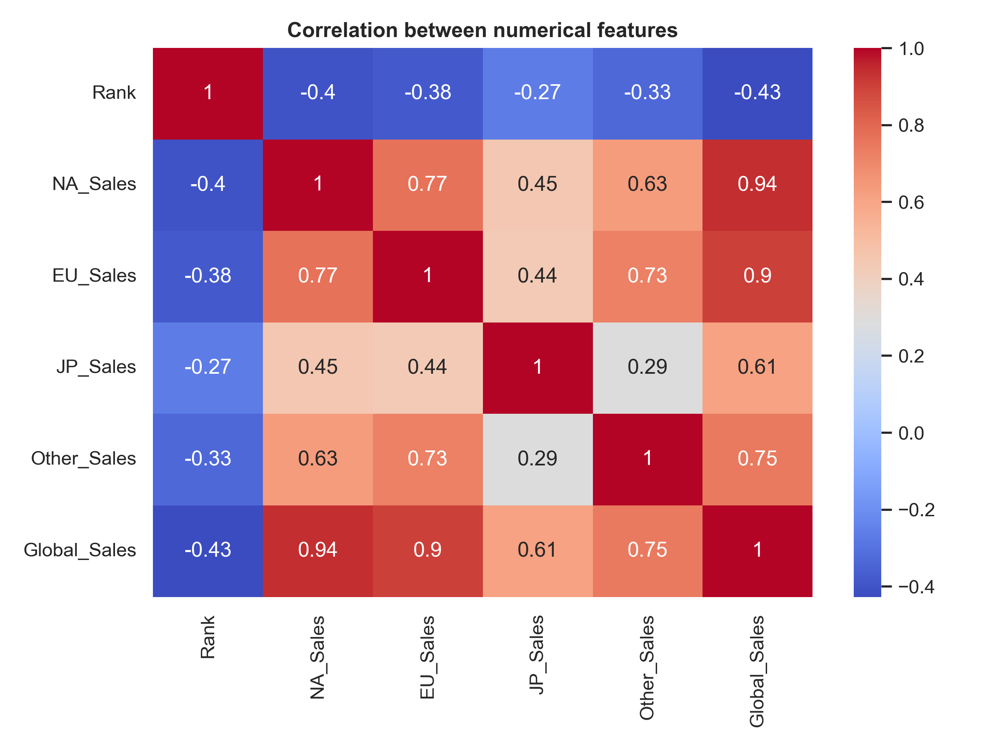
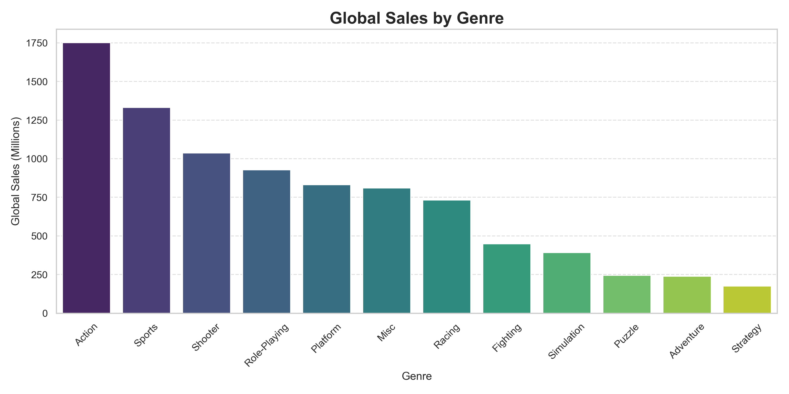
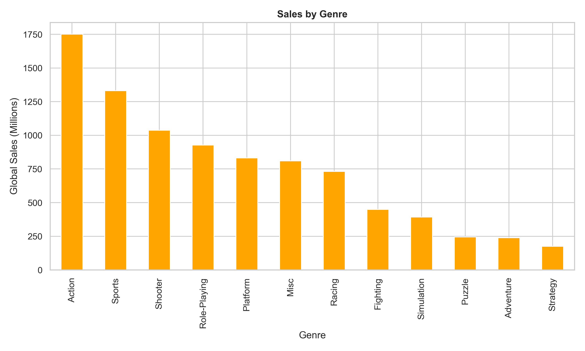
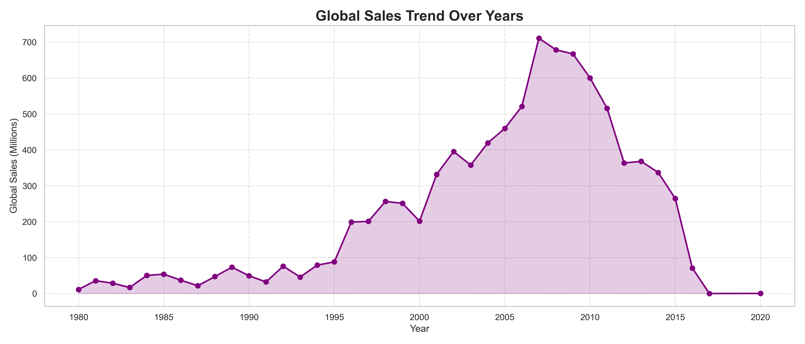
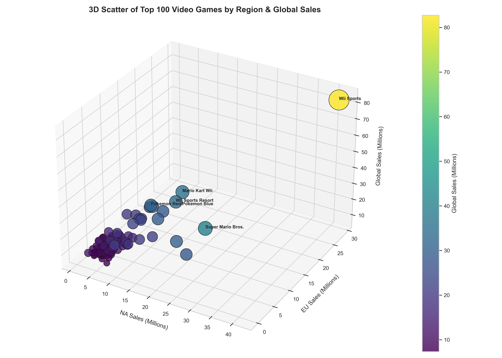
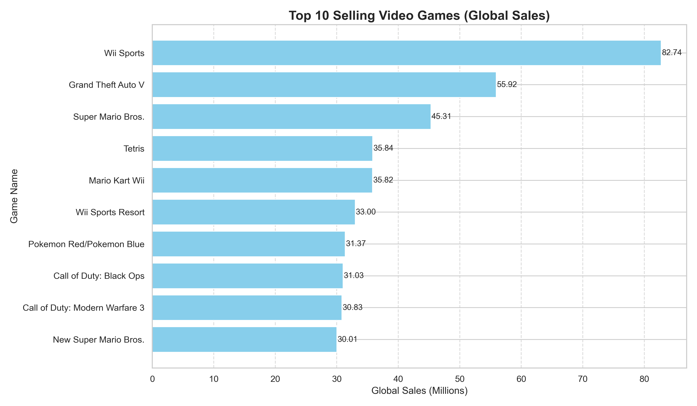
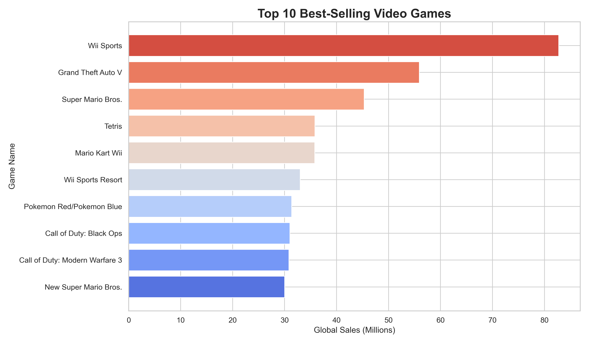
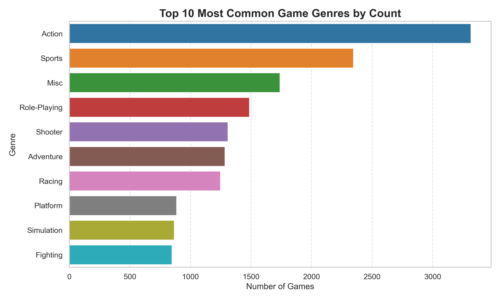

# 🎮 LevelUpAnalytics: Video Game Sales Analysis

---


## 📖 Introduction
Welcome to **LevelUpAnalytics**, an advanced data analytics project diving deep into the global video game industry. This project leverages a comprehensive dataset of video game sales to uncover trends, patterns, and actionable insights for developers, publishers, and stakeholders.  


By combining robust data cleaning, exploratory data analysis (EDA), and stunning visualizations, **LevelUpAnalytics** showcases the power of data-driven decision-making in understanding market dynamics, identifying top-performing games, and exploring player engagement trends.  


The project is built with **Python** and **Jupyter Notebook**, utilizing libraries like `pandas`, `matplotlib`, `seaborn`, and `plotly` to create interactive and visually appealing outputs. It serves as a key component of my data science portfolio at [mohamed-khalid3.github.io/portfolio](https://mohamed-khalid3.github.io/portfolio).


---


## 🎯 Objectives
The primary goals of **LevelUpAnalytics** are to:  

- **Analyze Sales Trends:** Examine global and regional sales patterns over time to identify market growth and decline.  
- **Identify Top Performers:** Highlight the best-selling games, genres, platforms, and publishers.  
- **Explore Genre Dynamics:** Understand which genres dominate in terms of sales and game count.  
- **Visualize Insights:** Create compelling visualizations to communicate findings effectively.  
- **Provide Actionable Recommendations:** Offer data-driven insights for developers and publishers to optimize strategies.

---

## 📂 Dataset

### Source
- Dataset: `vgsales.csv` from **Kaggle**  

### Description
The dataset contains **16,598 entries** with the following columns:  

| Column         | Description                                       |
|----------------|---------------------------------------------------|
| Rank           | Sales ranking of the game                         |
| Name           | Title of the video game                           |
| Platform       | Gaming platform (Wii, PS3, X360, etc.)           |
| Year           | Release year of the game                          |
| Genre          | Game genre (Action, Sports, RPG, etc.)           |
| Publisher      | Game publisher (Nintendo, Activision, etc.)      |
| NA_Sales       | Sales in North America (millions)                |
| EU_Sales       | Sales in Europe (millions)                        |
| JP_Sales       | Sales in Japan (millions)                         |
| Other_Sales    | Sales in other regions (millions)                |
| Global_Sales   | Total worldwide sales (millions)                 |

### Data Preprocessing
- **Cleaning:** Removed duplicates and imputed missing `Year` values with median.  
- **Transformation:** Converted `Year` to integer type for consistency.  
- **Validation:** Ensured data integrity for accurate analysis.

---

## 📁 Project Structure

```

LevelUpAnalytics/
│
├── 📋 vgsales.csv # Dataset
├── 📝 README.md # Project documentation
├── 🗂 scripts/
│ └── analyze_vgsales.py # Main Python script for analysis
├── 📊 notebooks/
│ └── video.game.analysis.ipynb # Jupyter Notebook with analysis
├── 📁 plots/ # Generated visualization images
│ ├── correlation_heatmap.png
│ ├── sales_by_genre.png
│ ├── sales_by_genre_orange.png
│ ├── sales_trend_years.png
│ ├── top100_3d_scatter.png
│ ├── top10_games.png
│ ├── top10_games_colorful.png
│ └── top10_genres_count_colorful.png
└── 📁 assets/ # Supporting files
└── images/ # Images used in README or portfolio
└── .gitkeep # Keeps the folder tracked in Git

```


## 🛠 Methodology

### Tools & Technologies
- **Python:** Data manipulation and visualization  
- **Libraries:** `pandas`, `numpy`, `matplotlib`, `seaborn`, `plotly`  
- **Jupyter Notebook:** Interactive EDA and visualization development  
- **Excel:** Supplementary data exploration and validation  

### Analysis Approach
1. **Data Loading & Cleaning:** Load dataset, remove duplicates, handle missing values.  
2. **Exploratory Data Analysis (EDA):** Analyze sales distributions across regions, genres, and platforms.  
3. **Visualization:** Create static and interactive charts (bar charts, line plots, 3D scatter, heatmaps) with professional styling.  
4. **Insights Generation:** Identify top performers, trends, and actionable recommendations.

---

## 📊 Key Visualizations

### 1️⃣ Correlation Heatmap
  
Shows correlations between regional and global sales, revealing strong relationships (e.g., NA and EU).

### 2️⃣ Sales by Genre
  
Highlights total global sales per genre, with Action and Sports as top performers.

### 3️⃣ Sales by Genre (Orange Palette)
  
Alternative color palette showcasing global sales by genre.

### 4️⃣ Global Sales Trend Over Years
  
Line plot showing rise and fall of global sales, peaking around 2008–2009.

### 5️⃣ Top 100 Games 3D Scatter
  
3D scatter of top 100 games; x/y axes are NA and EU sales, z-axis is global sales, bubble size represents total sales.

### 6️⃣ Top 10 Selling Games
  
Horizontal bar chart of the top 10 best-selling games globally.

### 7️⃣ Top 10 Selling Games (Colorful)
  
Colorful bar chart with sales annotations.

### 8️⃣ Top 10 Genres Count (Colorful)
  
Most common genres by game count with a colorful palette.

---

## 💡 Results & Insights
- **Top Games:** Wii Sports leads with 82.74M global sales.  
- **Popular Genres:** Action (1,749M) and Sports (1,330M) dominate in sales.  
- **Platform Trends:** PS2 (1,237M) and Wii (926M) are top platforms.  
- **Regional Patterns:** North America (4,396M) and Europe (2,433M) drive most sales.  
- **Sales Trends:** Global sales peak around 2008–2009, then decline post-2010.  
- **Correlations:** NA and EU sales highly correlated (0.77).

---

## 📌 Actionable Recommendations
- Focus on **Action and Sports genres** for highest returns.  
- Target **North America and Europe** for marketing campaigns.  
- Develop for popular platforms like **PS4** to leverage large user bases.  
- Monitor emerging trends like **mobile gaming**.  
- Collaborate with top publishers like **Nintendo** and **Activision** for market reach.

---

## ✅ Conclusion
**LevelUpAnalytics** provides a comprehensive analysis of the video game industry, highlighting top games, genres, platforms, and regional trends.  
It demonstrates proficiency in **data cleaning, EDA, visualization**, and communicating insights for informed decision-making.  
This project is a key showcase in my data science portfolio.

---

## ⚙️ Prerequisites
- Python 3.8+  
- Jupyter Notebook or JupyterLab  
- Required libraries:  
```bash
pip install pandas numpy matplotlib seaborn plotly
